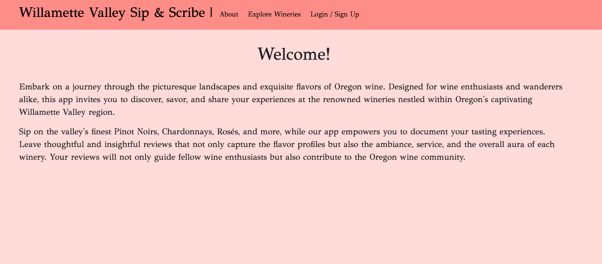
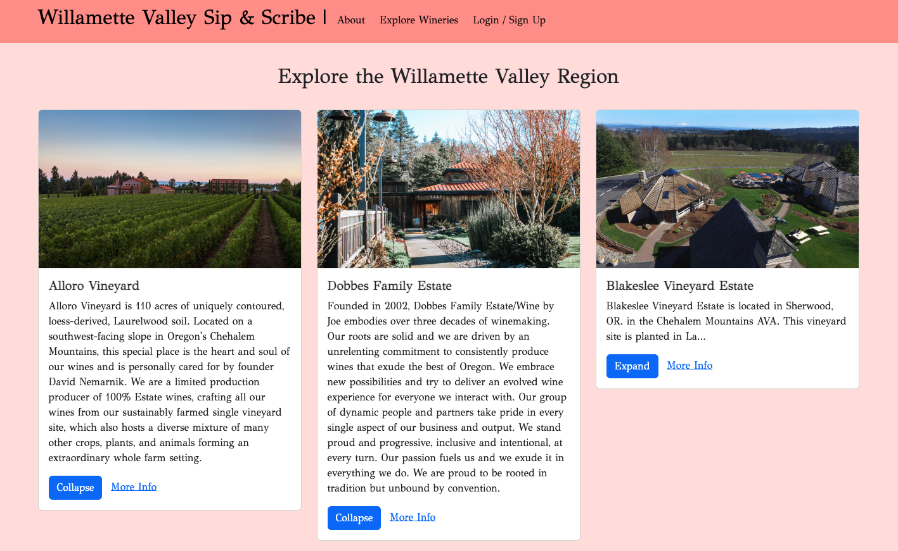
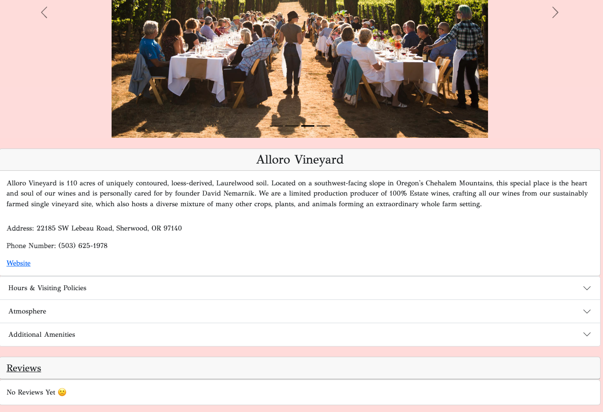
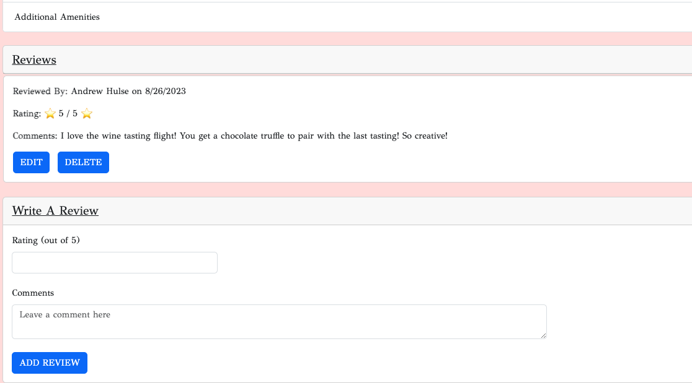

# Willamette Valley Sip & Scribe :wine_glass:

Embark on a journey through the picturesque landscapes and exquisite flavors of Oregon wine. Designed for wine enthusiasts and wanderers alike, this app invites you to discover, savor, and share your experiences at the renowned wineries nestled within Oregon's captivating Willamette Valley region.

Sip on the valley's finest Pinot Noirs, Chardonnays, Rosés, and more, while our app empowers you to document your tasting experiences. Leave thoughtful and insightful reviews that not only capture the flavor profiles but also the ambiance, service, and the overall aura of each winery. Your reviews will not only guide fellow wine enthusiasts but also contribute to the vibrant Willamette Valley wine community.

---

## Link to App :link:
[Willamette Valley Sip & Scribe](https://w-v-sip-and-scribe-a962479193e6.herokuapp.com/)

---

## Home Page 


---

## List of Wineries


---

## Winery Details


---

## Winery Review


---

## Code Preview
```js
<Col xs={12} md={6} lg={4} className='g-4'>
    <Card className={`card-container ${expanded ? 'card-expanded' : ''}`}>
        <Card.Img variant="top" src={winery.images[0]} className="card-image" />
        <Card.Body>
            <Card.Title><b>{winery.name}</b></Card.Title>
            <Card.Text>{expanded ? winery.overview : winery.overview.slice(0, 120) + '...'}</Card.Text>
            <Button variant="primary" onClick={toggleExpanded}>
                {expanded ? 'Collapse' : 'Expand'}
            </Button>
            &nbsp; &nbsp;
            <Link to={`/wineries/${(winery._id)}`} wineries={wineries} atmospheres={atmospheres} additionalAmenities={additionalAmenities} visitingPolicies={visitingPolicies}>
                More Info
            </Link>
            <Collapse in={expanded}>
            <div></div>
            </Collapse>
        </Card.Body>
    </Card>
</Col>

```
---
## Technologies Used
 
 
 
 
 <br>
 
 
 
 <br>
 

---
## Future Enhancements
   - [ ] Implement Google Places/Maps API to locate wineries on a map
   - [ ] Favorites Page/List for Users
   - [ ] Search functionality (with text) to find wineries
   - [ ] Search functionality (with filters) for specific amenities/atmospheres/visiting policies
   - [ ] Refer to Trello for all other enhancements: [Trello](https://trello.com/b/B6NVamFs/oregon-wine-app-mern-stack)
---

